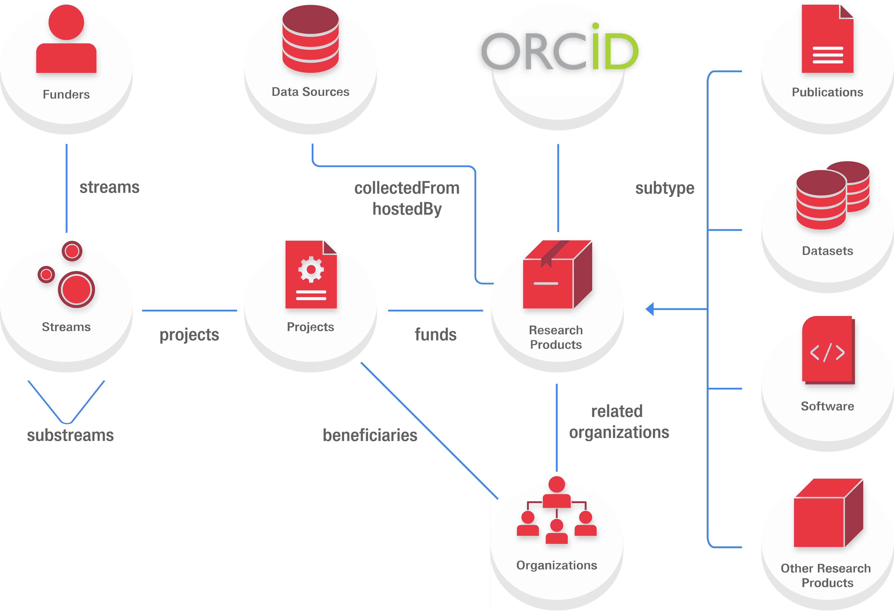

# Data model

The OpenAIRE Research Graph comprises several types of entities and [relationships](./relationships) among them.

The latest version of the JSON schema can be found on [Bulk downloads](../download).

The figure above, presents the graph's data model. 
Its main entities are described in brief below:

* [Research Products](entities/result) represent the outcomes of research activities.
* [Organizations](entities/organization) correspond to companies or research institutions involved in projects,
responsible for operating data sources or consisting the affiliations of Product creators.
* [Funders](entities/funder) (e.g. EC, Wellcome Trust) are agencies responsible for a list of Funding Streams.
* [Funding Streams](entities/funding-stream) represent investments (funding actions) from Funders (e.g. FP7 or H2020).
* [Projects](entities/project) are research projects funded by a Funding Stream of a Funder.
* [Data Sources](entities/data-source) are the resources used to collect metadata for the graph objects

TODO: communities are present in the existing documentation instead of funders and fundins streams

:::note Further reading

A detailed report on the OpenAIRE Research Graph Data Model can be found on [Zenodo](https://zenodo.org/record/2643199).
:::

