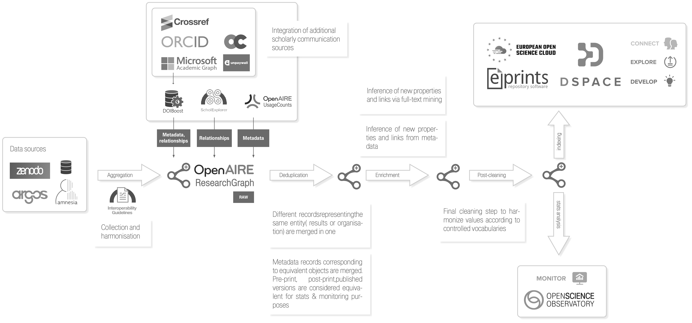

# Data provision 

source: https://graph.openaire.eu/about#tabs_card

OpenAIRE collects metadata records from more than 70K scholarly communication sources from all over the world, including Open Access institutional repositories, data archives, journals. All the metadata records (i.e. descriptions of research products) are put together in a data lake, together with records from Crossref, Unpaywall, ORCID, Grid.ac, and information about projects provided by national and international funders. Dedicated inference algorithms applied to metadata and to the full-texts of Open Access publications enrich the content of the data lake with links between research results and projects, author affiliations, subject classification, links to entries from domain-specific databases. Duplicated organisations and results are identified and merged together to obtain an open, trusted, public resource enabling explorations of the scholarly communication landscape like never before.

TODO: make this image linkable

