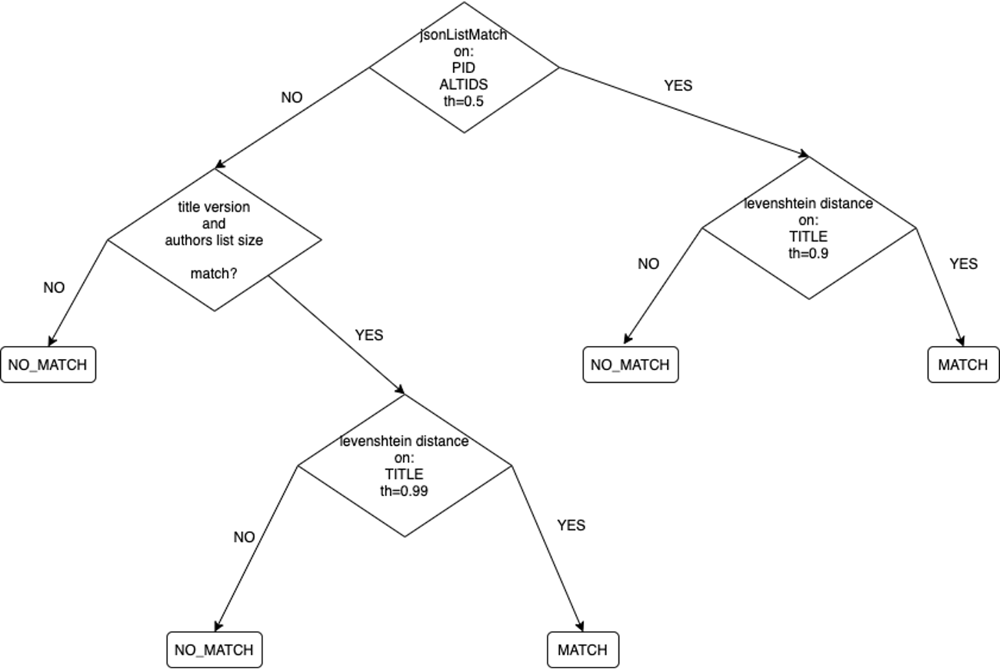

# Research results

Metadata records about the same scholarly work can be collected from different providers. Each metadata record can possibly carry different information because, for example, some providers are not aware of links to projects, keywords or other details. Another common case is when OpenAIRE collects one metadata record from a repository about a pre-print and another record from a journal about the published article. For the provision of statistics, OpenAIRE must identify those cases and “merge” the two metadata records, so that the scholarly work is counted only once in the statistics OpenAIRE produces.

Duplicates among research results are identified among results of the same type (publications, datasets, software, other research products). If two duplicate results are aggregated one as a dataset and one as a software, for example, they will never be compared and they will never be identified as duplicates.
OpenAIRE supports different deduplication strategies based on the type of results.

## Methodology overview

The deduplication process can be divided into two different phases:
* Candidate identification (clustering)
* Decision tree
* Creation of representative record

The implementation of each phase is different based on the type of results that are being processed.

### Publications 

#### Candidate identification (clustering)

Clustering is a common heuristics used to overcome the N x N complexity required to match all pairs of objects to identify the equivalent ones. The challenge is to identify a [clustering function](./clustering-functions) that maximizes the chance of comparing only records that may lead to a match, while minimizing the number of records that will not be matched while being equivalent. Since the equivalence function is to some level tolerant to minimal errors (e.g. switching of characters in the title, or minimal difference in letters), we need this function to be not too precise (e.g. a hash of the title), but also not too flexible (e.g. random ngrams of the title). On the other hand, reality tells us that in some cases equality of two records can only be determined by their PIDs (e.g. DOI) as the metadata properties are very different across different versions and no [clustering function](./clustering-functions) will ever bring them into the same cluster. To match these requirements OpenAIRE clustering for products works with two functions:
DOI: the function generates the DOI when this is provided as part of the record properties;
Title-based function: the function generates a key that depends on (i) number of significant words in the title (normalized, stemming, etc.), (ii) module 10 of the number of characters of such words, and (iii) a string obtained as an alternation of the function prefix(3) and suffix(3) (and vice versa) o the first 3 words (2 words if the title only has 2). For example, the title “Entity deduplication in big data graphs for scholarly communication” becomes “entity deduplication big data graphs scholarly communication” with two keys key “7.1entionbig” and “7.1itydedbig” (where 1 is module 10 of 54 characters of the normalized title.

#### Decision tree

For each pair of publications in a cluster the following strategy (depicted in the figure below) is applied.
Cross comparison of the pid lists (in the `pid` and `alternateid` elements). If 50% common pids, levenshtein distance on titles with low threshold (0.9).
Otherwise, check if the number of authors and the title version is equal. If so, levenshtein distance on titles with higher threshold (0.99).
The publications are matched as duplicate if the distance is higher than the threshold, in every other case they are considered as distinct publications.

#### Creation of representative record
TODO

### Datasets
TODO

### Software
TODO

### Other types of research products
TODO

